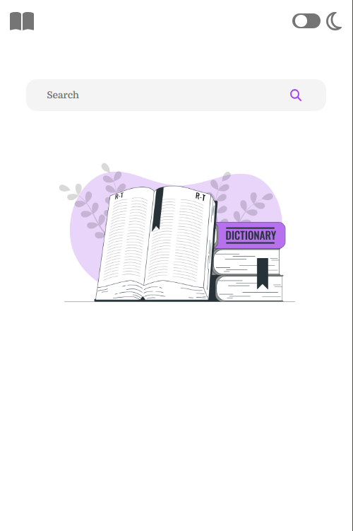
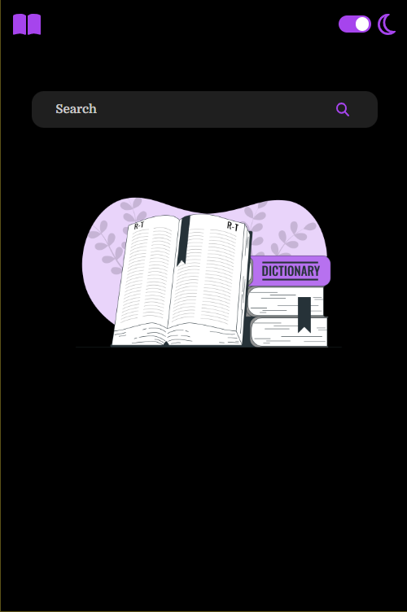
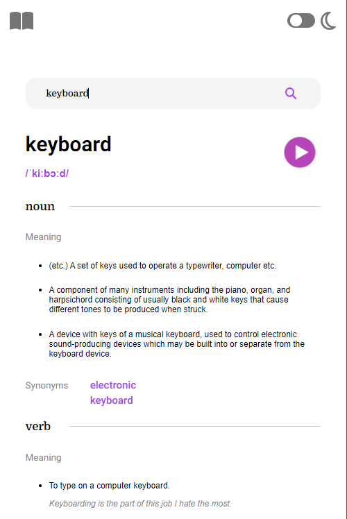
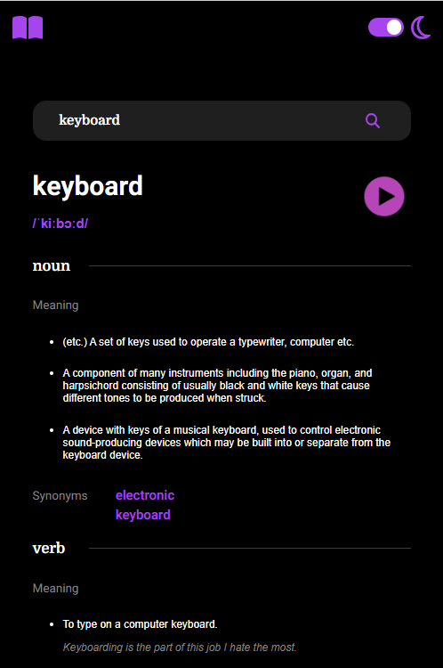

# Frontend Mentor - Dictionary web app

This is a solution to the [Dictionary web app](https://www.frontendmentor.io/challenges/dictionary-web-app-h5wwnyuKFL). 

## Table of contents

- [Overview](#overview)
  - [The challenge](#the-challenge)
  - [Screenshot](#screenshot)
  - [Links](#links)
- [My process](#my-process)
  - [Built with](#built-with)

## Overview

### The challenge

Users should be able to

- Search for words using the input field
- See the Free Dictionary API's response for the searched word
- See a form validation message when trying to submit a word that doesn't exist in the Free Dictionary API
- Play the audio file for a word when it's available
- Switch between light and dark themes
- View the optimal layout for the interface depending on their device's screen size

### Screenshot

### Links

- Live Site URL: [https://lidijamarinkovicdictionary.netlify.app/](https://lidijamarinkovicdictionary.netlify.app/)

## My process

### Built with

- React JS
- API